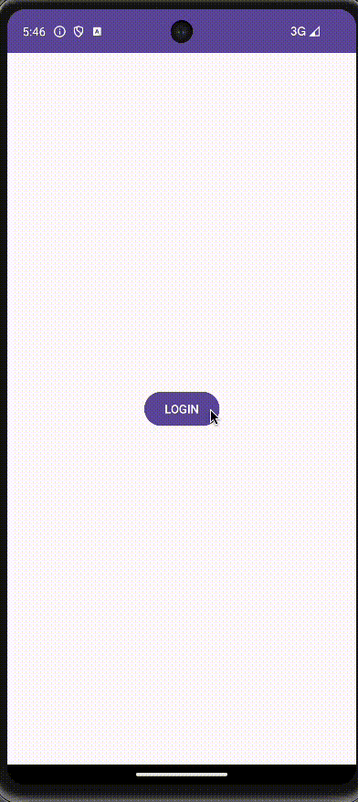

# Selfie App

Seflie App, user can take a photo using the front camera and it will be automatically added to their feed.

## Functionality 

The following **required** functionality is completed:

* [ ] User is able to login/register an account with the app.
* [ ] User can take a photo using the front facing camera and it will automatically save to their feed.

The following **extensions** are implemented:

* CameraX
* Glide

## Video Walkthrough

Here's a walkthrough of implemented user stories:

## Notes

* There weren't many challenges with building the app. The hardest part was laying out the structure of the project.

## License

    Copyright 2023 Alex LaPointe. All rights reserved.

    Licensed under the Apache License, Version 2.0 (the "License");
    you may not use this file except in compliance with the License.
    You may obtain a copy of the License at

        http://www.apache.org/licenses/LICENSE-2.0

    Unless required by applicable law or agreed to in writing, software
    distributed under the License is distributed on an "AS IS" BASIS,
    WITHOUT WARRANTIES OR CONDITIONS OF ANY KIND, either express or implied.
    See the License for the specific language governing permissions and
    limitations under the License.
